# EDA 분석(이커머스 주문 데이터)

## 1. 환경 설정
```py
import pandas as pd
import numpy as np
import matplotlib.pyplot as plt
import seaborn as sns
import koreanize_matplotlib
```

## 2. 데이터 불러오기
```py
# 같은 폴더에 있는 CSV 파일을 읽는 방식
df = pd.read_csv("../../data/eda_example_ecommerce_orders.csv")

df.head()
```
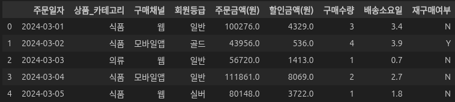

## 3. 데이터 전처리
### 1) 데이터 정보 확인하기
```py
df.info()
```
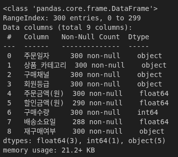

```py
df.describe()
```
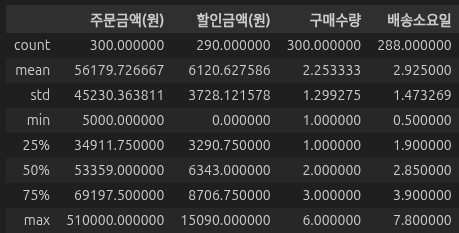

```py
df.describe(include="object")
```
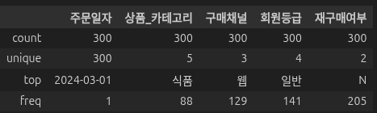

**📌 확인 포인트**
- 어떤 컬럼이 범주형 데이터인지 확인  
- 결측치가 있는 컬럼이 무엇인지 확인  
- 금액 데이터 분포가 자연스러운지 확인

### 2) 데이터 형 변환
```py
df["주문일자"] = pd.to_datetime(df["주문일자"])
df.dtypes
```
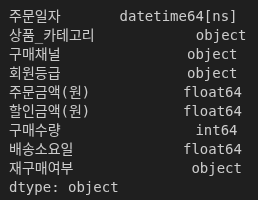

### 3) 결측치 파악 및 처리
```py
df.isnull().sum()
```
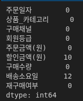

```py
# 배송소요일 결측치 → 중앙값으로 대체
df["배송소요일"] = df["배송소요일"].fillna(df["배송소요일"].median())

# 할인금액 결측치 → 할인 없음으로 가정
df["할인금액(원)"] = df["할인금액(원)"].fillna(0)

df.isnull().sum()
```
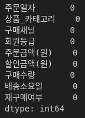

**💡 생각해볼 질문**  
- 왜 배송소요일이 비었을지 추정  
- 할인금액 결측을 0으로 처리하는 가정의 타당성 판단

### 4) 이상치 파악 및 처리
```py
plt.boxplot(df["주문금액(원)"])
plt.title("주문금액 분포")
plt.show()
```
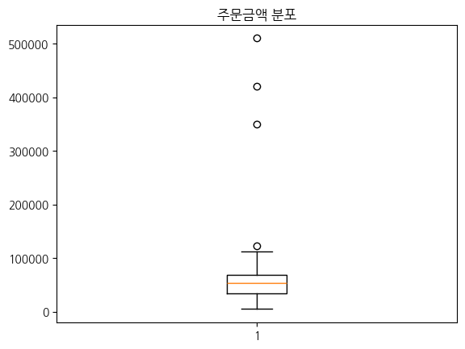

```py
# IQR 기준 이상치 확인
q1 = df["주문금액(원)"].quantile(0.25)
q3 = df["주문금액(원)"].quantile(0.75)
iqr = q3 - q1

upper_bound = q3 + 1.5 * iqr
df[df["주문금액(원)"] > upper_bound]
```
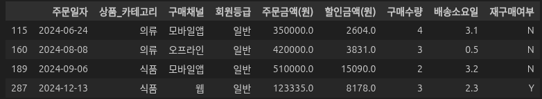

**📌 주의**
- 이상치는 무조건 제거 대상이 아님  
- VIP/단체구매/오류 등 가설을 세운 뒤 처리 필요

### 5) 파생 변수 생성(스케일 변환 포함)
```py
# 실결제금액
df["실결제금액(원)"] = df["주문금액(원)"] - df["할인금액(원)"]

# 상품 단가
df["상품단가(원)"] = df["주문금액(원)"] / df["구매수량"]

df.head()
```
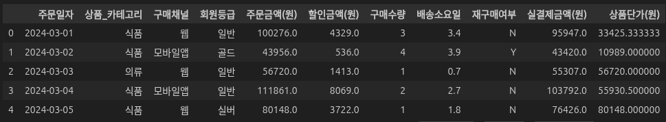

## 4. 데이터 탐색하기
### 1) 컬럼 탐색하기
#### (1) 주문금액 분포
```py
plt.hist(df["주문금액(원)"], bins=30, edgecolor="black")
plt.title("주문금액 분포")
plt.xlabel("주문금액")
plt.ylabel("빈도")
plt.show()
```
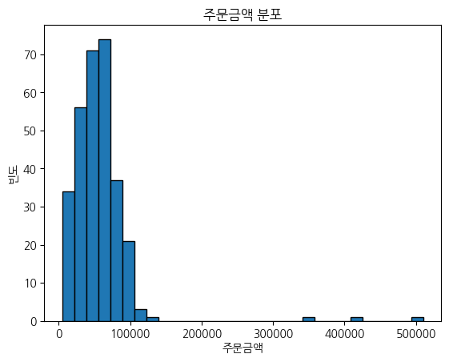

```py
sns.histplot(df["주문금액(원)"], bins=30, kde=True)
plt.title("주문금액 분포 (seaborn)")
plt.show()
```
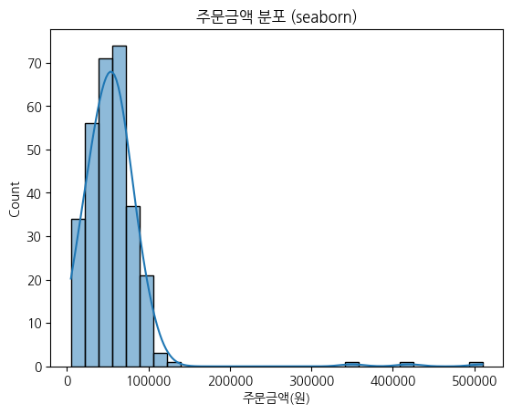

#### (2) 파이 차트 : 구매 채널 비율
```py
channel_counts = df["구매채널"].value_counts()

plt.pie(channel_counts, labels=channel_counts.index, autopct="%.1f%%", startangle=90)
plt.title("구매채널 비율")
plt.show()
```
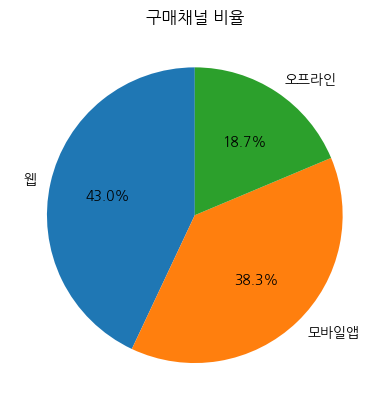

### 2) 그룹별 탐색하기
#### (1) groupby로 숫자 요약 후 시각화: 상품 카테고리별 평균 주문금액
```py
category_summary = df.groupby("상품_카테고리")["주문금액(원)"].mean()
category_summary
```
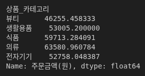

```py
category_summary.plot(kind="bar")
plt.title("상품 카테고리별 평균 주문금액")
plt.ylabel("평균 주문금액")
plt.xticks(rotation=0)  # x축 라벨 회전
plt.show()
```
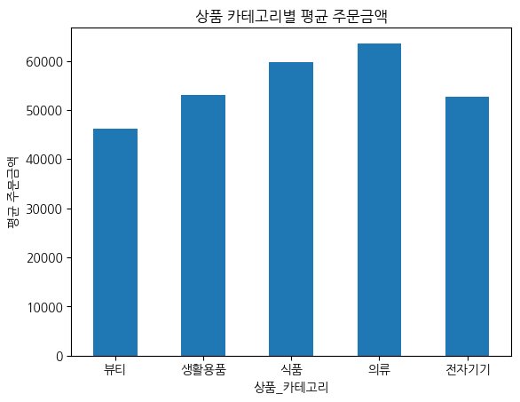

#### (2) seaborn으로 요약 없이 바로 시각화: 상품 카테고리별 평균 주문금액
```py
sns.barplot(data=df, x="상품_카테고리", y="주문금액(원)", estimator=np.mean)
plt.title("상품 카테고리별 평균 주문금액 (seaborn)")
plt.show()
```
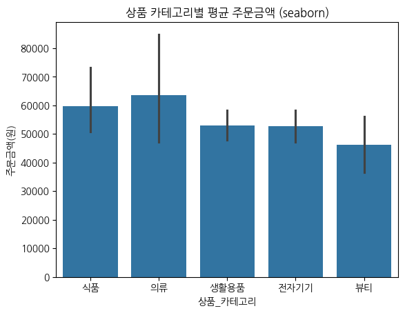

#### (3) 히트맵: 회원등급 × 구매채널 평균 주문금액
```py
pivot_table = df.pivot_table(
    values="주문금액(원)", index="회원등급", columns="구매채널", aggfunc="mean"
)

pivot_table
```
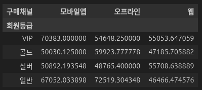

```py
sns.heatmap(pivot_table, annot=True, fmt=".0f", cmap="YlOrRd")
plt.title("회원등급 × 구매채널 평균 주문금액")
plt.show()
```
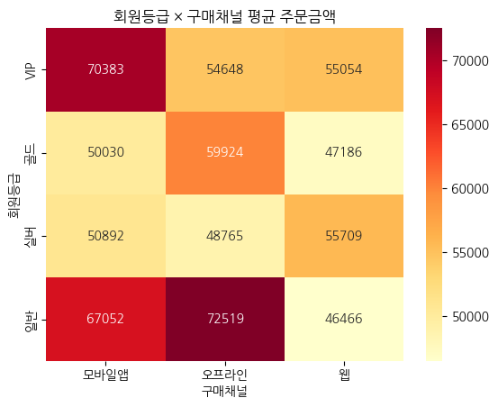

#### (4) 회원등급별 실결제금액 분포 (박스플롯)
```py
df.groupby("회원등급")["실결제금액(원)"].mean()
```
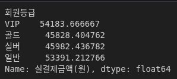
```py
sns.boxplot(data=df, x="회원등급", y="실결제금액(원)")
plt.title("회원등급별 실결제금액 분포")
plt.show()
```
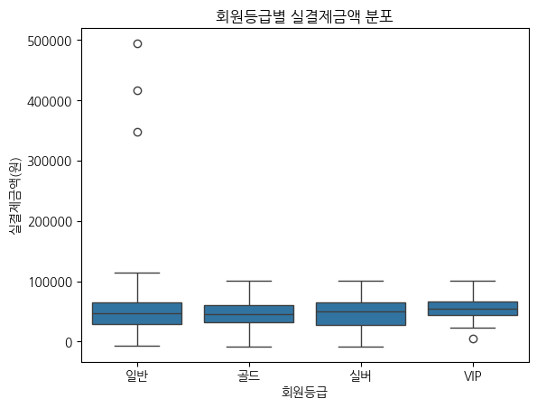

### 3) 컬럼 간 관계 파악하기
#### (1) 산점도: 주문금액 vs 배송소요일
#### (2) seaborn 산점도: 구매채널별 색상
```py
sns.scatterplot(data=df, x="주문금액(원)", y="배송소요일", hue="구매채널")
plt.title("주문금액과 배송소요일 (구매채널별)")
plt.show()
```
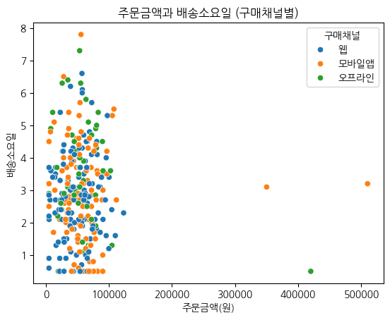

#### (3) 버블 차트: 주문금액 × 배송소요일 × 구매수량
```py
plt.scatter(df["주문금액(원)"], df["배송소요일"], s=df["구매수량"] * 40, alpha=0.6)
plt.xlabel("주문금액")
plt.ylabel("배송소요일")
plt.title("주문금액 vs 배송소요일 (버블: 구매수량)")
plt.show()
```
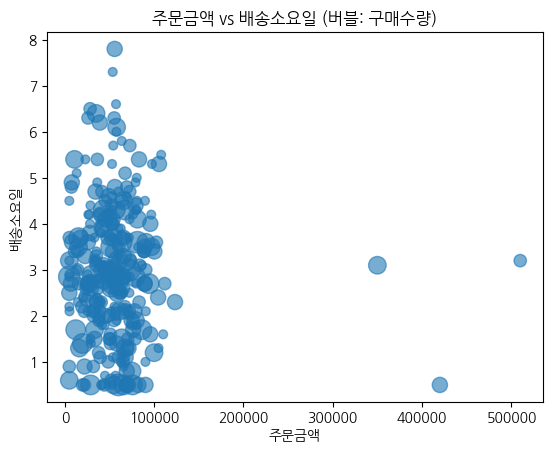
```py
channels = df["구매채널"].unique()
colors = ["red", "blue", "green"]

for channel, color in zip(channels, colors):
    subset = df[df["구매채널"] == channel]

    plt.scatter(
        subset["주문금액(원)"],
        subset["배송소요일"],
        s=subset["구매수량"] * 40,
        alpha=0.6,
        label=channel,
        color=color,
    )

plt.xlabel("주문금액")
plt.ylabel("배송소요일")
plt.title("주문금액 vs 배송소요일 (구매채널별)")
plt.legend()
plt.show()
```
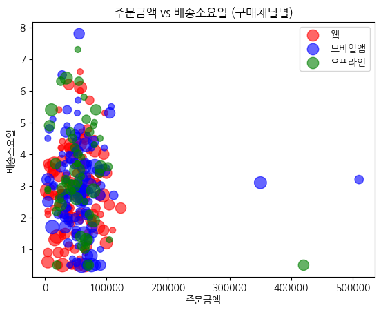

#### (4) 히트맵:: 수치형 변수 상관관계
```py
# 숫자형 컬럼만 선택
numeric_df = df[
    [
        "주문금액(원)",
        "할인금액(원)",
        "구매수량",
        "배송소요일",
        "실결제금액(원)",
        "상품단가(원)",
    ]
]

# 상관계수 계산
corr_matrix = numeric_df.corr()

corr_matrix
```
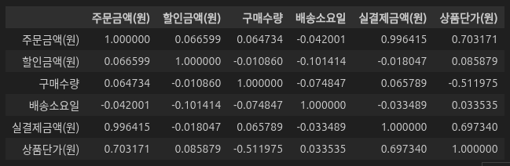

```py
sns.heatmap(corr_matrix, annot=True, fmt=".2f", cmap="coolwarm", center=0)
plt.title("수치형 변수 간 상관관계 히트맵")
plt.show()
```
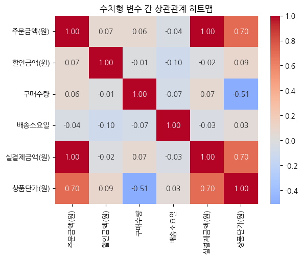

### 4) 시계열 탐색하기
#### (1) groupby로 일별 합계 계산 후 시각화
```py
daily_sales = df.groupby("주문일자")["주문금액(원)"].sum()
daily_sales.head()
```
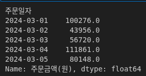

```py
plt.figure(figsize=(10, 3))
plt.plot(daily_sales.index, daily_sales.values)
plt.title("일별 주문금액 추이")
plt.xlabel("날짜")
plt.ylabel("주문금액 합계")
plt.show()
```
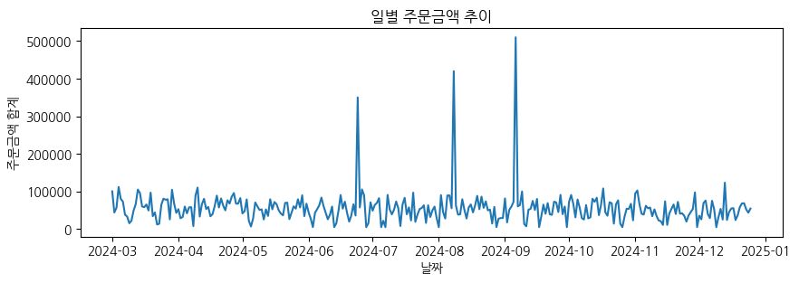

### 5) seaborn으로 한 번에 보는 비교 시각화
#### (1) 재구매 여부별 주문금액 분포 (박스플롯)
```py
sns.boxplot(data=df, x="재구매여부", y="주문금액(원)")
plt.title("재구매 여부별 주문금액 분포")
plt.show()
```
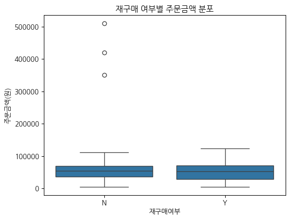

### 6) 선택: 여러 변수 한 번에 보기 (pairplot)
```py
sns.pairplot(
    df[["주문금액(원)", "배송소요일", "구매수량", "실결제금액(원)"]], diag_kind="hist"
)
plt.show()
```
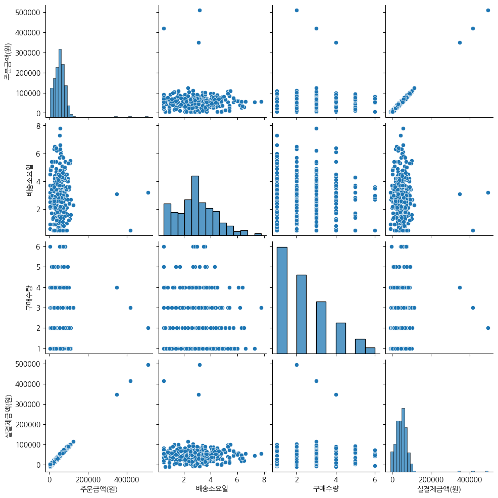

**📌 주의**
- 데이터가 커지면 오래 걸릴 수 있음  
- 모든 상황에 항상 적합한 시각화는 아님

## 5. 사용 가이드
이 노트북은 **정답지**가 아니라 **참고서**임  

- 데이터 구조 파악 방식  
- 탐색 순서  
- 질문을 던지는 방식  

만 참고하고, 실제 과제 데이터에서는 **컬럼 이름/분포/결측 구조**가 달라질 수 있으므로  
코드를 그대로 실행하기보다 **데이터에 맞게 수정**하는 연습이 필요함  

📌 추천 검색 키워드 예시  
- `seaborn countplot`  
- `seaborn boxplot outliers`  
- `matplotlib time series plot`  
- `seaborn heatmap pivot_table`  
- `bubble chart matplotlib size`

