# 1. 형태소 분석기
## 1) Konlpy - Okt 형태소 분석기
```py
# konlpy, jpype1, java 11버전 설치
uv add konlpy jpype1
```

```py
from konlpy.tag import Okt

okt = Okt()

sentence = "무궁화꽃이피었습니다."
result = okt.pos(sentence)
print(result)
```
```py
# 단어와 품사를 보여줌
okt.pos()

[('무궁화', 'Noun'), ('꽃', 'Noun'), ('이', 'Josa'), ('피었습니다', 'Verb'), ('.', 'Punctuation')]
```
```py
# 단어만 보여줌
okt.morphs()

['안녕하세요', '.', '저', '는', '형태소', '분석', '기', '에요', '.']
```
```py
 # 명사만 보여주는 함수
okt.nouns()

['저', '형태소', '분석', '기']
```
```py
text1 = "나는 밥 먹었엌ㅋㅋㅋㅋㅋㅋㅋ"
text2 = "나는 밥을 먹었다."
text3 = "나는 밥을 먹는다."

# norm : 교정 , stem : 일반적인 단어로
result1 = okt.pos(text1)
result1_norm = okt.pos(text1, norm=True)
result2 = okt.pos(text2)
result2_stem = okt.pos(text2, stem=True)
result3 = okt.pos(text3)
result3_stem = okt.pos(text3, stem=True)

# 결과
[('나', 'Noun'), ('는', 'Josa'), ('밥', 'Noun'), ('먹었엌', 'Noun'), ('ㅋㅋㅋㅋㅋㅋㅋ', 'KoreanParticle')]
[('나', 'Noun'), ('는', 'Josa'), ('밥', 'Noun'), ('먹었어', 'Verb'), ('ㅋㅋㅋ', 'KoreanParticle')]
[('나', 'Noun'), ('는', 'Josa'), ('밥', 'Noun'), ('을', 'Josa'), ('먹었다', 'Verb'), ('.', 'Punctuation')]
[('나', 'Noun'), ('는', 'Josa'), ('밥', 'Noun'), ('을', 'Josa'), ('먹다', 'Verb'), ('.', 'Punctuation')]
[('나', 'Noun'), ('는', 'Josa'), ('밥', 'Noun'), ('을', 'Josa'), ('먹는다', 'Verb'), ('.', 'Punctuation')]
[('나', 'Noun'), ('는', 'Josa'), ('밥', 'Noun'), ('을', 'Josa'), ('먹다', 'Verb'), ('.', 'Punctuation')]
```
```py
# 반복문, 조건문으로만 "Noun"인 (단어, 품사)를 추출하기
text = "안녕하세요. 저는 형태소 분석기입니다."
result = okt.pos(text)

print(result)
print(len(result), type(result))
print("="*50)
# 반복 변수 정의: word
# 반복 출력: result에서 word를 꺼내서 출력
# 조건 : word의 1번째 요소가 Noun이면, 출력 아니면 출력하지 않음
#        if word[1] == "Noun":
for word in result:
    if word[1] == "Noun":
        # print(word) # (단어, 품사) 출력하기
        print(word[0])# 단어 출력하기
# 결과
[('안녕하세요', 'Adjective'), ('.', 'Punctuation'), ('저', 'Noun'), ('는', 'Josa'), ('형태소', 'Noun'), ('분석', 'Noun'), ('기입', 'Noun'), ('니', 'Noun'), ('다', 'Josa'), ('.', 'Punctuation')]
10 <class 'list'>
==================================================
저
형태소
분석
기입
니
```

## 2) Kiwipiepy - Kiwi 형태소 분석기
```py
uv add kiwipiepy
```
```py
from kiwipiepy import Kiwi

kiwi = Kiwi()
result = kiwi.analyze("안녕하세요 형태소 분석기 키위입니다.")
print(result)

# 결과
[([Token(form='안녕', tag='NNG', start=0, len=2), Token(form='하', tag='XSA', start=2, len=1), Token(form='세요', tag='EF', start=3, len=2), Token(form='형태소', tag='NNG', start=6, len=3), Token(form='분석기', tag='NNG', start=10, len=3), Token(form='키위', tag='NNG', start=14, len=2), Token(form='이', tag='VCP', start=16, len=1), Token(form='ᆸ니다', tag='EF', start=16, len=3), Token(form='.', tag='SF', start=19, len=1)], -61.105079650878906)]

# Point : 리스트 안에 어떤 요소가 몇 개 있는지 프린트하면서 파악할 수 있다.
print(f"result = {result}")
# print(len(result), type(result))
# print("="*50)
# print(f"result[0] = {result[0]}")
# print(len(result[0]), type(result[0]))
# print("="*50)
# print(f"result[0][0] = {result[0][0]}")   # res
# print(f"result[0][1] = {result[0][1]}")   # score
print("="*50)
# print(f"result[0][0]의 타입: {type(result[0][0])}, result[0][1]의 길이: {len(result[0][0])}")
# 반복 변수 정의 : word
# 반복 출력: result에서 하나씩 뽑아서 word에 담은 후 차례대로 출력
# 조건
for res, score in result:
    print(f"res = {res}")
    for r in res:
        if r.tag[0] == "N":
            print(f"r = {r}")
            print(f"form = {r.form}, tag = {r.tag}")
            print("-"*50)

# 결과 
result = [([Token(form='안녕', tag='NNG', start=0, len=2), Token(form='하', tag='XSA', start=2, len=1), Token(form='세요', tag='EF', start=3, len=2), Token(form='형태소', tag='NNG', start=6, len=3), Token(form='분석기', tag='NNG', start=10, len=3), Token(form='키위', tag='NNG', start=14, len=2), Token(form='이', tag='VCP', start=16, len=1), Token(form='ᆸ니다', tag='EF', start=16, len=3), Token(form='.', tag='SF', start=19, len=1)], -61.105079650878906)]
==================================================
res = [Token(form='안녕', tag='NNG', start=0, len=2), Token(form='하', tag='XSA', start=2, len=1), Token(form='세요', tag='EF', start=3, len=2), Token(form='형태소', tag='NNG', start=6, len=3), Token(form='분석기', tag='NNG', start=10, len=3), Token(form='키위', tag='NNG', start=14, len=2), Token(form='이', tag='VCP', start=16, len=1), Token(form='ᆸ니다', tag='EF', start=16, len=3), Token(form='.', tag='SF', start=19, len=1)]
r = Token(form='안녕', tag='NNG', start=0, len=2)
form = 안녕, tag = NNG
--------------------------------------------------
r = Token(form='형태소', tag='NNG', start=6, len=3)
form = 형태소, tag = NNG
--------------------------------------------------
r = Token(form='분석기', tag='NNG', start=10, len=3)
form = 분석기, tag = NNG
--------------------------------------------------
r = Token(form='키위', tag='NNG', start=14, len=2)
form = 키위, tag = NNG
```
```py
from kiwipiepy import Kiwi

kiwi = Kiwi()

text = "안녕하세요. 저는 형태소 분석기 입니다."

result = kiwi.analyze(text)
print(result)
print(len(result))
print("="*50)
# analyze 함수의 결과는 1개의 요소(튜플)를 가지고 있다.
result_0 = result[0]
print(result_0)
print(len(result_0))
print("="*50)
# 튜플 안에는 요소가 2개 있다.
print(result_0[0]) # 내가 필요한거 여기 있다.
print(result_0[1])
final_result = result_0[0]
print("="*50)
print(final_result)
print(len(final_result))

# 결과
[([Token(form='안녕', tag='NNG', start=0, len=2), Token(form='하', tag='XSA', start=2, len=1), Token(form='세요', tag='EF', start=3, len=2), Token(form='.', tag='SF', start=5, len=1), Token(form='저', tag='NP', start=7, len=1), Token(form='는', tag='JX', start=8, len=1), Token(form='형태소', tag='NNG', start=10, len=3), Token(form='분석기', tag='NNG', start=14, len=3), Token(form='이', tag='VCP', start=18, len=1), Token(form='ᆸ니다', tag='EF', start=18, len=3), Token(form='.', tag='SF', start=21, len=1)], -49.22109603881836)]
1
==================================================
([Token(form='안녕', tag='NNG', start=0, len=2), Token(form='하', tag='XSA', start=2, len=1), Token(form='세요', tag='EF', start=3, len=2), Token(form='.', tag='SF', start=5, len=1), Token(form='저', tag='NP', start=7, len=1), Token(form='는', tag='JX', start=8, len=1), Token(form='형태소', tag='NNG', start=10, len=3), Token(form='분석기', tag='NNG', start=14, len=3), Token(form='이', tag='VCP', start=18, len=1), Token(form='ᆸ니다', tag='EF', start=18, len=3), Token(form='.', tag='SF', start=21, len=1)], -49.22109603881836)
2
==================================================
[Token(form='안녕', tag='NNG', start=0, len=2), Token(form='하', tag='XSA', start=2, len=1), Token(form='세요', tag='EF', start=3, len=2), Token(form='.', tag='SF', start=5, len=1), Token(form='저', tag='NP', start=7, len=1), Token(form='는', tag='JX', start=8, len=1), Token(form='형태소', tag='NNG', start=10, len=3), Token(form='분석기', tag='NNG', start=14, len=3), Token(form='이', tag='VCP', start=18, len=1), Token(form='ᆸ니다', tag='EF', start=18, len=3), Token(form='.', tag='SF', start=21, len=1)]
-49.22109603881836
==================================================
[Token(form='안녕', tag='NNG', start=0, len=2), Token(form='하', tag='XSA', start=2, len=1), Token(form='세요', tag='EF', start=3, len=2), Token(form='.', tag='SF', start=5, len=1), Token(form='저', tag='NP', start=7, len=1), Token(form='는', tag='JX', start=8, len=1), Token(form='형태소', tag='NNG', start=10, len=3), Token(form='분석기', tag='NNG', start=14, len=3), Token(form='이', tag='VCP', start=18, len=1), Token(form='ᆸ니다', tag='EF', start=18, len=3), Token(form='.', tag='SF', start=21, len=1)]
11
```
```py
# 명사인 단어만 추출해서 noun_list에 저장하기
## kiwi에서 명사는 tag가 N으로 시작한다.
## 조건 표현 방법 1 - tag[0] == "N"  표현 방법 2 - tag.startswith("N")
noun_list = []
for res in final_result:
    form = res.form
    tag = res.tag
    if tag.startswith("N"):
        noun_list.append(form)
        print(res)
        print(f"form={form}, tag={tag}")
print("="*100)
print(noun_list)

# 결과
Token(form='안녕', tag='NNG', start=0, len=2)
form=안녕, tag=NNG
Token(form='저', tag='NP', start=7, len=1)
form=저, tag=NP
Token(form='형태소', tag='NNG', start=10, len=3)
form=형태소, tag=NNG
Token(form='분석기', tag='NNG', start=14, len=3)
form=분석기, tag=NNG
====================================================================================================
['안녕', '저', '형태소', '분석기']
```
```py
from kiwipiepy import Kiwi

kiwi = Kiwi()

text = "안녕하세요. 저는 형태소 분석기 입니다."

result = kiwi.tokenize(text)
print(result)

# 결과
[Token(form='안녕', tag='NNG', start=0, len=2), Token(form='하', tag='XSA', start=2, len=1), Token(form='세요', tag='EF', start=3, len=2), Token(form='.', tag='SF', start=5, len=1), Token(form='저', tag='NP', start=7, len=1), Token(form='는', tag='JX', start=8, len=1), Token(form='형태소', tag='NNG', start=10, len=3), Token(form='분석기', tag='NNG', start=14, len=3), Token(form='이', tag='VCP', start=18, len=1), Token(form='ᆸ니다', tag='EF', start=18, len=3), Token(form='.', tag='SF', start=21, len=1)]
```

# 2. 텍스트 데이터 분석
## 1) 파일 불러오기
```py
# data / appreply.csv 파일 열기
import pandas as pd

df = pd.read_csv(
    "../data/appreply.csv",  # "/content/appreply.csv",
    index_col=0,
)
```

## 2) 데이터 전처리
```py
df.info()
## 결측치 없애는 함수 : dropna()
## 인덱스를 초기화하는 함수: reset_index(drop=True)
df2 = df.dropna().reset_index(drop=True)
# 전처리 데이터 저장하기
df2.to_csv(
    "../data/appreply2.csv",  # "/content/appreply2.csv"
)
# 전처리 데이터 불러오기
df_new = pd.read_csv(
    "../data/appreply2.csv",  # "/content/appreply2.csv",
    index_col=0,
)
```

### 3) 데이터 탐색
### (1) score별 데이터 개수 확인하기
```py
## score별로 리뷰가 몇개씩 있나요?
df_new["score"].unique()
=============================
array([4, 5, 1, 2, 3])
score_summary = df_new["score"].value_counts().sort_index()
score_summary

```
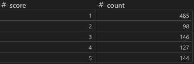

```py
import matplotlib.pyplot as plt
import koreanize_matplotlib

plt.figure(figsize=(5, 3))
score_summary.plot(kind="bar")
plt.title("댓글 별점 막대그래프")
plt.xticks(rotation=0)  # x 축 라벨 회전시키기
plt.show()
```
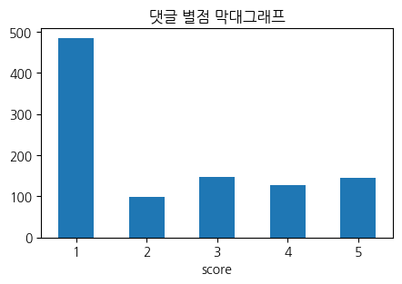

### (2) 새로운 reaction 열 만들기
```py
## np.where(조건, 참이면 넣을 값, 거짓이면 넣을 값)
## 새로운 변수 reaction을 만들고 싶어요. score가 3보다 크면 긍정, 아니면 부정
import numpy as np

df_new["reaction"] = np.where(df_new["score"] > 3, "긍정", "부정")
df_new.head(2)

```
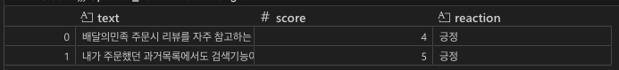

```py
## reaction별로 리뷰가 몇개씩 있나요?
reaction_summary = df_new["reaction"].value_counts().sort_values()
reaction_summary
```
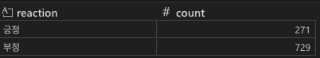

```py
import matplotlib.pyplot as plt
import koreanize_matplotlib

plt.figure(figsize=(5, 3))
reaction_summary.plot(kind="bar")
plt.title("댓글 긍부정 반응 막대그래프")
plt.xticks(rotation=0)  # x 축 라벨 회전시키기
plt.show()
```
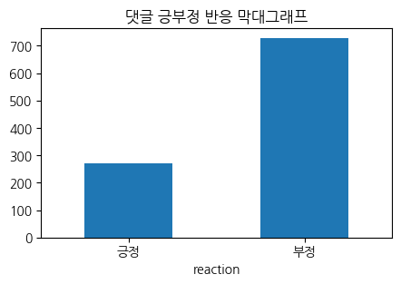

### (3) 새로운 length 열 만들기
```py
df_new["length"] = df_new["text"].str.len()
# length 기준으로 가장 긴 text는 무엇일까? -> 정렬: length 기준으로 내림차순 정렬
df_new.sort_values(by=["length"], ascending=False)
```
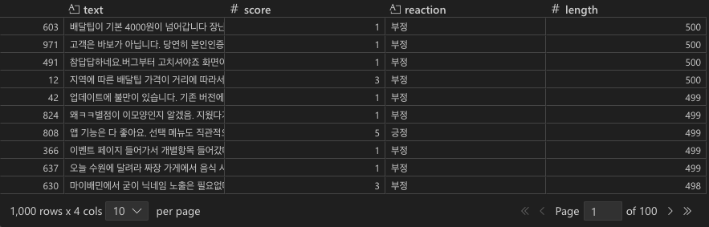
```py
plt.figure(figsize=(5, 3))
plt.hist(df_new["length"], bins=30, edgecolor="black")
plt.title("리뷰 텍스트 길이 히스토그램")
plt.xlabel("리뷰 길이")
plt.ylabel("빈도")
plt.show()
```
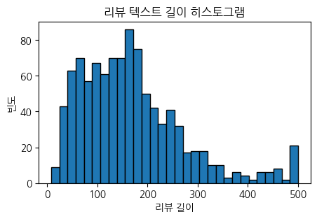
### (4) 워드클라우드

정규표현식
```py
import re

text = "오늘!!!!!!!       ㄴㄴㄴㄴㄴㄴ너무 ㅓㅑㅏㄴ 추워어어 very cold VERY COLD 010-0000-0040 ^^ ㅎㅇㅎㅇ"

# re.sub(패턴, 대체할값, 대상): 대상에서 "패턴"을 파악한후 그 값을 "대체할 값"으로 바꾼다.
# 패턴: "[^0-9a-zA-Zㄱ-ㅎㅏ-ㅣ가-힣\s]" : 숫자, 영어 소문자, 영어 대문자, 자음, 모음, 한글, 띄어쓰기가 아닌 것
new_text = re.sub("[^0-9a-z\s]", "", text)
print(new_text)

#         very cold   01000000040  
```
```py
# 정규표현식: 이모지만 제거하고 싶을땐?
text = "🌞좋은 아침입니다 :car:  :car  : :smileㅋㅋㅋ:"

## 이모지제거도구: emoji (터미널에서 uv add emoji)
from emoji import core

result = core.replace_emoji(text, "")  # text에서 이모지를 없애주세요
print(result)

## :smile: 과 같은 이모지 표현 제거
result = re.sub(":[a-zA-Z0-9_+-]+:", "", text)
## : : 안에 영어 소문자, 영어 대문자, 숫자, _, +, - 이 있는데
## []+ : 여러 개 있을거다
print(result)

# 정규표현식: 이모지만 제거하고 싶을땐?
text = "🌞좋은 아침입니다 :car:  :car  : :smileㅋㅋㅋ:"

## 이모지제거도구: emoji (터미널에서 uv add emoji)
from emoji import core

result = core.replace_emoji(text, "")  # text에서 이모지를 없애주세요
print(result)

## :smile: 과 같은 이모지 표현 제거
result = re.sub(":[a-zA-Z0-9_+-]+:", "", text)
## : : 안에 영어 소문자, 영어 대문자, 숫자, _, +, - 이 있는데
## []+ : 여러 개 있을거다
print(result)
=======================================
좋은 아침입니다 :car:  :car  : :smileㅋㅋㅋ:
🌞좋은 아침입니다   :car  : :smileㅋㅋㅋ:
```
```py
import re

text = "0-9a-zA-Z가-힣 안녕하세요!! Hello_123 #특수문자"

clean_text1 = re.sub(r"^0-9a-zA-Z가-힣\s", "", text)
clean_text2 = re.sub(r"[^0-9a-zA-Z가-힣\s]+", "", text)

print(f"결과: {clean_text1}")
print(f"결과: {clean_text2}")

결과: 안녕하세요!! Hello_123 #특수문자
결과: 09azAZ가힣 안녕하세요 Hello123 특수문자
```

단어 리스트 만들기
```
# 목표: 데이터프레임을 단어 리스트로 만드는 것

# 0. 빈 리스트를 만든다. word_list, stopwords
# 1. 데이터프레임에서 text 값을 하나씩 뽑는다. -> 문장 sent
# 2. sent에서 필요없는 문자(특수문자, 이모지 등)를 없앤다. (패턴: [^0-9a-zA-Z가-힣\s]) -> clean sent
# 3. 형태소 분석기로 문장을 단어 리스트로 뽑는다.(조건: Noun, 단어길이가 1보다 큰것, stopwords에 없는것) -> result
## 3-1. (단어, 품사) 쌍의 리스트로 결과를 출력한다.
## 3-2. 하나씩 뽑아서 품사가 Noun인지 확인한다.(반복)
## 3-3. word가 stopwords에 있으면 건너뛴다.
## 3-4. 품사가 Noun이고 word 길이가 1보다 큰 것을 sub list에 담는다.
# 4. word_list에 조건에 따라 추출한 result 요소들을 추가한다.
```

```py
from konlpy.tag import Okt

okt = Okt()

text = "안녕하세요. 파이썬입니다."
result_morphs = okt.morphs(text)
print(result_morphs)
result_pos = okt.pos(text)
print(result_pos)

['안녕하세요', '.', '파이썬', '입니다', '.']
[('안녕하세요', 'Adjective'), ('.', 'Punctuation'), ('파이썬', 'Noun'), ('입니다', 'Adjective'), ('.', 'Punctuation')]
```
```py
# 0. 빈 리스트를 만든다. word_list, stopwords
word_list = []
stopwords = ["배민", "배달"]

# 1. 데이터프레임에서 text 값을 하나씩 뽑는다. -> 문장 sent
for sent in df_new["text"]:
    # 2. sent에서 필요없는 문자(특수문자, 이모지 등)를 없앤다. (패턴: [^0-9a-zA-Z가-힣\s])
    clean_sent = re.sub("[^0-9a-zA-Z가-힣\s]", "", sent)
    # 3. 형태소 분석기로 문장을 단어 리스트로 뽑는다.(조건: Noun, 단어길이가 1보다 큰것, stopwords에 없는것) -> result
    ## 3-1. (단어, 품사) 쌍의 리스트로 결과를 출력한다.
    result = okt.pos(clean_sent)
    ## 3-2. 하나씩 뽑아서 품사가 Noun인지 확인한다.(반복)
    sub_list = []
    for res in result:
        word = res[0]
        pos = res[1]
        ## 3-3. word가 stopwords에 있으면 건너뛴다.
        if word in stopwords:
            continue
        ## 3-4. 품사가 Noun이고 word 길이가 1보다 큰 것을 sub list에 담는다.
        if pos == "Noun" and len(word) > 1:
            sub_list.append(word)
    print(sub_list)
    # 4. word_list에 조건에 따라 추출한 result 요소들을 추가한다.
    word_list.extend(sub_list)
    # print(f"{sent[:40]}")
    # print(f"{clean_sent[:40]}")
    # print(result)
    print("=" * 100)

['민족', '주문', '리뷰', '자주', '참고', '편입', '한가지', '건의', '사항', '최신', '점순', '주문', '자하', '메뉴', '메뉴', '리뷰', '확인', '기능', '메뉴', '검색', '기능', '리뷰', '특정', '메뉴', '검색', '기능', '주문', '수가', '메뉴', '리뷰', '보기', '위해', '래그', '시간', '소요', '효율', '발생', '긍정', '검토', '주심']
====================================================================================================
['주문', '과거', '목록', '검색', '기능', '분명', '가게', '기억', '찾기', '메뉴', '검색', '곱창', '치면', '과거', '곱창', '목록', '가게', '리뷰', '리뷰', '보기']
====================================================================================================
['검색', '화면', '전체', '포장', '크롤', '아래', '크롤', '자꾸만', '왼쪽', '오른쪽', '전체', '포장', '정말', '검색', '포장', '마트', '하나', '선택', '좌우', '가끔', '크롤', '왼쪽', '전체', '가게']
====================================================================================================
['정렬', '가게', '가장', '위로', '지역', '추가', '별도', '체크', '이상', '장난', '하나', '하나', '가격', '대별', '금액', '체크', '별도', '확인']
====================================================================================================
['최근', '업데이트', '안드로이드', '사양', '정도', '어플', '실행', '업데이트', '하라', '업데이트', '업데이트', '진행', '열기', '열기', '업데이트', '무한', '반복', '삭제', '설치', '환경설정', '증상', '다른', '증상', '이번', '업데이트', '관련', '파일', '확인', '참고', '사양', '핸드폰', '사양', '문제', '이번', '업데이트']
====================================================================================================
['매장', '구분', '대체', '언제', '이면', '개선', '독점', '해이', '건가', '결제', '관련', '부분', '정말', '별로', '구성', '정말', '페이', '사용', '절차', '매장', '한식', '양식', '중식', '카페', '업종', '별로', '구분', '매장', '개도', '이름', '전부', '매번', '찾기', '검색', '거나', '주문', '목록']
====================================================================================================
['실행', '로그인', '여부', '먼저', '비회', '이용', '선택', '경우', '나중', '입력', '선택', '주문', '결제', '주소', '설정', '순서', '변경', '어플', '설치', '삭제', '설치', '자주', '다시', '사용', '설치', '실행', '회원정보', '주소', '저장', '어플', '실행', '로그인', '여부', '주소', '다시', '설정', '처음', '주소', '설정', '주문', '어차피', '로그', '시간', '매번', '추가', '드네', '어플', '사용', '사람', '혹시', '굳이', '주문', '상태', '주소', '설정', '이유', '수정', '사항', '라면', '그냥', '어플', '삭제', '사용', '순서', '정도', '라면', '사용자', '로서', '굳이', '주소', '설정', '필요', '의견']
====================================================================================================
['음식', '시간', '리뷰', '요청', '알림', '상단', '리뷰', '적기', '위해', '알림', '그냥', '실행', '예전', '버그', '답변', '추가', '내용', '알림', '핸드폰', '알림', '알림', '알림', '터치', '구동', '실행', '그냥', '알림', '리뷰', '작성', '라나', '알림', '다른', '알림', '알림', '터치', '정상', '실행', '리뷰', '알림']
====================================================================================================
['식사', '한번', '최소', '이상', '주문', '거기', '기본', '이면', '누가', '수수료', '장사', '가게', '수수료', '음식', '자체', '책정', '가게', '보기', '가게', '자꾸', '점좀', '개선']
====================================================================================================
['차단', '옵션', '생기', '자주', '추천', '자주', '차단', '잠시', '자주', '불만족', '차단', '옵션', '다음', '업데이트']
====================================================================================================
['이용', '사용자', '가지', '건의', '사항', '리뷰', '대신', '방문', '표시', '방문', '표시', '생각', '혹시', '건의', '사항', '다시', '정말', '정말']
====================================================================================================
['결제', '수단', '현장', '결제', '아예', '코로나', '때문', '비대', '권장', '이제', '마스크', '착용', '필수', '추세', '제한', '예전', '현장', '결제', '조금', '어플', '가장', '사용']
====================================================================================================
['지역', '가격', '거리', '따라서', '다른', '이해', '책정', '방법', '불만', '자체', '위치', '자동', '가격', '메뉴판', '여러', '동네', '기입', '고객', '방식', '운영', '부분', '통일', '하나', '방법', '모두', '통일', '불만', '자체', '고객', '신경', '그냥', '가격', '방식', '고객', '입장', '메뉴판', '음식', '중심', '위치', '가게', '부터', '얼마나', '차이', '신경', '가뜩이나', '거기', '추가', '금액', '뭔가', '불합리', '메뉴판', '자체', '주목', '점주', '각오', '깜빡', '고객', '전화', '개선']
...
['취소', '전화', '제도', '주문', '상황', '주문', '취소', '나중', '취소', '상황', '진짜', '업체', '상황', '얘기', '취소', '얼마나', '가요', '진짜']
====================================================================================================
['민족', '사용', '다섯', '가지', '주로', '현금', '결제', '경우', '현금', '결제', '사람', '리뷰', '이벤트', '대상', '제외', '영수증', '리뷰', '이벤트', '코드', '코드', '리뷰', '보완', '현금', '결제', '고객', '카드', '결제', '고객', '리뷰', '이벤트', '참여']
====================================================================================================

print(len(word_list))

20581
```

단어 카운팅하기(Counter)
```py
from collections import Counter

example = ["남", "여", "여", "남", "남", "남", "응답없음"]
counter = Counter(example)
print(counter)

Counter({'남': 4, '여': 2, '응답없음': 1})

# 기능 많이 발생한 순서대로 n개 추출
count_most = counter.most_common(2)
print(count_most)
print(dict(count_most))

[('남', 4), ('여', 2)]
{'남': 4, '여': 2}
```

워드클라우드 그리기
```
uv add wordcloud
```
```py
from collections import Counter

counter = Counter(word_list)
```
```py
from wordcloud import WordCloud
import matplotlib.pyplot as plt
import koreanize_matplotlib

wc = WordCloud(
    # font_path="C:\Windows\Fonts\malgun.ttf",  # "/usr/share/fonts/truetype/nanum/NanumGothic.ttf"
    font_path="/System/Library/Fonts/AppleSDGothicNeo.ttc",
    background_color="white",
    width=800,
    height=400,
)

wc.generate_from_frequencies(counter)

plt.figure(figsize=(5, 5))
plt.imshow(wc, interpolation="bilinear")
plt.axis("off")
plt.title("배달의 민족 워드 클라우드(명사)", fontsize=15)
plt.show()
```
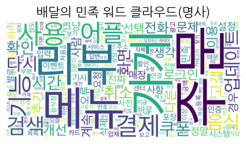

```py
rom wordcloud import WordCloud
import matplotlib.pyplot as plt
import koreanize_matplotlib

wc = WordCloud(
    font_path="/System/Library/Fonts/AppleSDGothicNeo.ttc",
    # font_path="C:\Windows\Fonts\malgun.ttf",  # "/usr/share/fonts/truetype/nanum/NanumGothic.ttf"
    background_color="white",
    width=800,
    height=400,
)

wc.generate_from_frequencies(dict(counter.most_common(50)))

plt.figure(figsize=(5, 5))
plt.imshow(wc, interpolation="bilinear")
plt.axis("off")
plt.title("배달의 민족 워드 클라우드(명사)", fontsize=15)
plt.show()
```
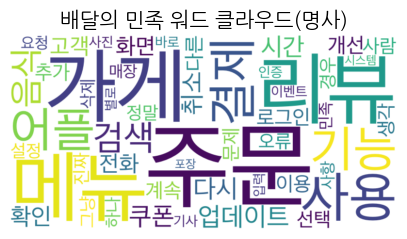

```py
from wordcloud import WordCloud
import matplotlib.pyplot as plt
import koreanize_matplotlib

from PIL import Image
import numpy as np

image = Image.open("../images/circle.png")  # ./images/heart.png
mask_img = np.array(image)

wc = WordCloud(
    font_path="/System/Library/Fonts/AppleSDGothicNeo.ttc",
    # font_path="C:\Windows\Fonts\malgun.ttf",  # "/usr/share/fonts/truetype/nanum/NanumGothic.ttf"
    background_color="white",
    mask=mask_img,
    width=800,
    height=400,
)

wc.generate_from_frequencies(counter)

plt.figure(figsize=(5, 5))
plt.imshow(wc, interpolation="bilinear")
plt.axis("off")
plt.title("배달의 민족 워드 클라우드(명사)", fontsize=15)
plt.show()
```
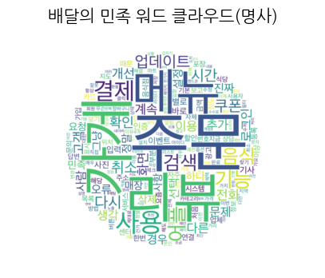

### (5) 워드 클라우드 활용하기
```py
# 무조건 많이 발생한 단어들만 의미가 있을까? --> 데이터 마이닝: 숨어져 있는 것을 찾아냄, 의외의 단어 키워드를 찾아보자.
# 워드클라우드만 보고 텍스트 분석을 할 수 있을까? --> 실제 데이터를 찾아보고 특징 파악하기

# 데이터프레임에서 특정 단어가 포함된 데이터만 출력하려면 어떻게 해야 할까요?
# 전처리 데이터 불러오기
import pandas as pd

df_new = pd.read_csv(
    "../data/appreply2.csv",  # "/content/appreply2.csv",
    index_col=0,
)

keyword = "로그인"
# df_new["text"].str.contains(keyword) # 조건
login_df = df_new.loc[df_new["text"].str.contains(keyword), :]
```

```py
from konlpy.tag import Okt
import re
from wordcloud import WordCloud
import matplotlib.pyplot as plt
import koreanize_matplotlib

okt = Okt()

# login_df의 text에서 단어들을 뽑아내서 워드클라우드를 그려보기

# 0. 빈 리스트를 만든다. word_list, stopwords
word_list = []
stopwords = ["배민", "배달", "로그인"]

# 1. 데이터프레임에서 text 값을 하나씩 뽑는다. -> 문장 sent
for sent in login_df["text"]:
    # 2. sent에서 필요없는 문자(특수문자, 이모지 등)를 없앤다. (패턴: [^0-9a-zA-Z가-힣\s])
    clean_sent = re.sub("[^0-9a-zA-Z가-힣\s]", "", sent)
    # 3. 형태소 분석기로 문장을 단어 리스트로 뽑는다.(조건: Noun, 단어길이가 1보다 큰것, stopwords에 없는것) -> result
    ## 3-1. (단어, 품사) 쌍의 리스트로 결과를 출력한다.
    result = okt.pos(clean_sent)
    ## 3-2. 하나씩 뽑아서 품사가 Noun인지 확인한다.(반복)
    sub_list = []
    for res in result:
        word = res[0]
        pos = res[1]
        ## 3-3. word가 stopwords에 있으면 건너뛴다.
        if word in stopwords:
            continue
        ## 3-4. 품사가 Noun이고 word 길이가 1보다 큰 것을 sub list에 담는다.
        if pos == "Noun" and len(word) > 1:
            sub_list.append(word)
    print(sub_list)
    # 4. word_list에 조건에 따라 추출한 result 요소들을 추가한다.
    word_list.extend(sub_list)
    # print(f"{sent[:40]}")
    # print(f"{clean_sent[:40]}")
    # print(result)
    print("=" * 100)

wc = WordCloud(
    font_path="/System/Library/Fonts/AppleSDGothicNeo.ttc",
    # font_path="C:\Windows\Fonts\malgun.ttf",  # "/usr/share/fonts/truetype/nanum/NanumGothic.ttf"
    background_color="white",
    width=800,
    height=400,
)

wc.generate_from_frequencies(counter)

plt.figure(figsize=(5, 5))
plt.imshow(wc, interpolation="bilinear")
plt.axis("off")
plt.title("로그인이 언급된 배달의 민족 워드 클라우드(명사)", fontsize=15)
plt.show()
```
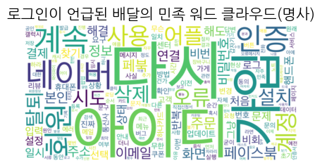